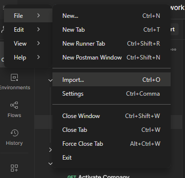

# David's SaaS Backend Project

In order to run the application, follow these steps:

1.  **Install dependencies:**

```bash
npm install
```

2.  **Start the application:**

```bash
npm run dev
```

If you're using Docker, simply run:

```bash
docker  run  -p  4000:4000  saas-backend
```

3. **Postman API**

The application has a `saas-backend.postman_collection.json` file that you can **import** into Postman and see the collection of APIs for the reference.



4. **Postman API**

In order to see Prisma Studio for database collection, write in the terminal:

```bash
npx prisma studio
```

